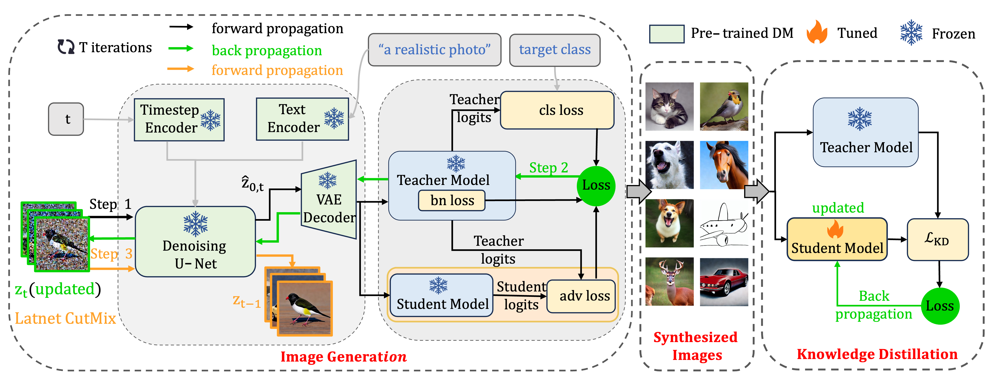

# <h1 align="center">Data-Free Knowledge Distillation with Diffusion Models</h1>

<!-- [](https://arxiv.org/abs/2503.06132) -->

## DiffDFKD
This repository provides the official implementation of **DiffDFKD**([](https://arxiv.org/abs/2504.00870)), a novel data-free knowledge distillation framework utilizing diffusion models.
**Oral Presentation**: Accepted as an Oral at **IEEE ICME 2025** (Nantes, France, June 30 - July 4, 2025) {insert\_element\_1\_}.



## Requirements
To set up the necessary dependencies, run the following command:
```bash
pip install -r requirements.txt
```

## Quick Start

### 1. Prepare Required Files
#### CIFAR Dataset
For experiments on the **CIFAR dataset**, download the pre-trained teacher models from [Dropbox-Models (266 MB)](https://www.dropbox.com/sh/w8xehuk7debnka3/AABhoazFReE_5mMeyvb4iUWoa?dl=0), originally provided by [Fast-Datafree](https://github.com/zju-vipa/Fast-Datafree/tree/main). Extract the downloaded files into the following directory:
```bash
pretrained_models/cifar
```
#### DomainNet Dataset
For experiments on the **DomainNet dataset**, you can train a teacher model from scratch using the command below:
```bash
bash script/train_from_scratch/domainnet.sh
```

### 2. Generate Synthetic Data
To synthesize data that aligns with the teacher model's knowledge distribution, run:
```bash
bash script/generate_data/generate_data_domainNet.sh
```

### 3. Perform Knowledge Distillation
After generating the synthetic dataset, you can perform knowledge distillation to train the student model by executing:
```bash
bash script/distill/distill.sh
```

## Citation
If you find our work helpful for your research, please cite our paper:
```bibtex
@article{qi2025data,
  title={Data-free Knowledge Distillation with Diffusion Models},
  author={Qi, Xiaohua and Li, Renda and Peng, Long and Ling, Qiang and Yu, Jun and Chen, Ziyi and Chang, Peng and Han, Mei and Xiao, Jing},
  journal={arXiv preprint arXiv:2504.00870},
  year={2025}
}
```
## Note
Due to the loss of original code, we have recreated the core logic based on our understanding. There might be potential bugs in the current implementation.


## Acknowledgements
This project is built upon the foundations of [FedCADO](https://github.com/MingzhaoYang/FedCADO) and [Fast-Datafree](https://github.com/zju-vipa/Fast-Datafree/tree/main). We sincerely appreciate their contributions to data-free knowledge distillation research.

